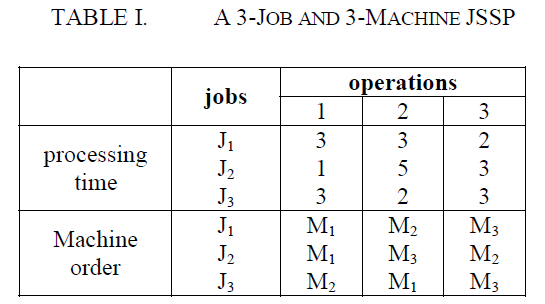
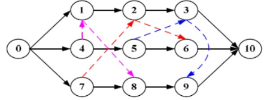
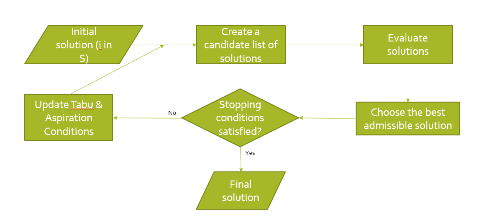

# job-shop-scheduling-problem
JSS Problem solved using Artificial Intelligence techniques
Problem Statement: 
Given n jobs, each composed of m operations that must be processed on m machines.
Each operation uses one of the m machines for a fixed duration.
Each machine can process at most one operation at a time and once an operation initiates processing on a given machine it must complete processing on that machine without interruption.
The operations of a given job have to be processed in a given order.
The problem is to find a schedule of the operations on the machines, taking into account the precedence constraints, and minimizes the makespan, that is, the finish time of the last operation completed in the schedule.

Constraints:
There are several constraints for the job shop problem
No task for a job can be started until the previous task for that job is completed.
A machine can only work on one task at a time.
A task, once started, must run to completion.

The problem is solved by using Tabu Search which gives us a local optimal solution.

Later, a better solution is looked for using the Genetic Algorithm: the chromosome consists of n*m genes, i.e., each job will appear m times exactly.

Selection Operator:
The fitness function is the function of the objectives function and defined as 𝑓(𝑖)=1/𝑚𝑎𝑘𝑒𝑠𝑝𝑎𝑛.
The selective probability is p(i)=f(i)/(summation of f(k), where k is from 1 to N)

Crossover Operator:
The good  gene characteristics preservation and the feasibility are the most important criteria to design crossover operation in JSSP.
The offspring generated can keep the good characteristics of the problem structure and satisfy the feasibility.

Mutation Operator: Given an individual chromosome, mutation generates the child by the following procedure,
Calculate the critical path of the individual.
Permuting two successive operations v and w assigned to the same machine with probability of pm for which the arc(v,w) is on the critical path in that individual.
